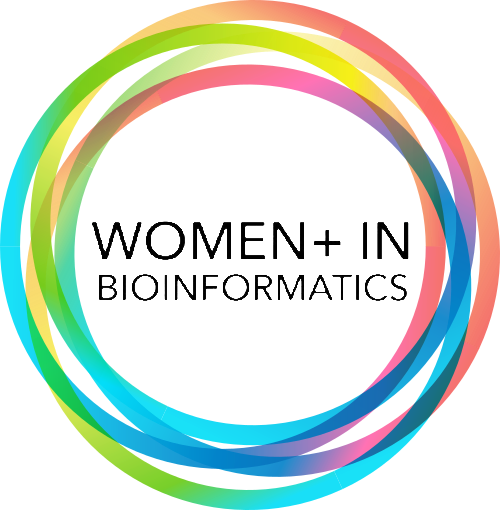

# Boston-Area Women in Bioinformatics Website



## Quick Links

- [Using Claude Code Skills (Recommended)](#using-claude-code-skills)
- [Manual Instructions](MANUAL.md)
- [Getting started with the website (Mac)](#getting-started-with-the-website-mac)
- [Getting started without write-access](#getting-started-without-write-access)
- [Image Organization](#image-organization)

## Using Claude Code Skills

This repository includes [Claude Code](https://claude.ai/code) skills that automate common content tasks — adding events, blog posts, newsletters, and more. Instead of manually creating files and filling in frontmatter by hand, you describe what you want and Claude creates the file for you.

### Install Claude Code

1. **Install the CLI:**

   ```bash
   npm install -g @anthropic-ai/claude-code
   ```

2. **Authenticate** — you'll need an Anthropic API key or a Claude.ai Pro/Max subscription:

   ```bash
   claude
   ```

   Follow the prompts to log in.

3. **Open a terminal in this repository** and run `claude` to start a session.

### Available Commands

| Command              | What it does                                                        |
| :------------------- | :------------------------------------------------------------------ |
| `/add-event`         | Creates a new event page in `src/content/meetups/`                  |
| `/add-blog-post`     | Creates a new blog post in `src/content/post/`                      |
| `/add-blog-series`   | Creates a new series metadata file in `src/content/series/`         |
| `/add-newsletter`    | Creates a new newsletter issue in `src/content/newsletter/`         |
| `/add-archive-video` | Adds a video to the recorded meetings archive                       |
| `/add-resource`      | Adds a new resource to `src/content/resources/`                     |
| `/add-community`     | Adds a new partner community to `src/content/partnerCommunities/`   |
| `/add-team-member`   | Adds a new team member to `team.js` and the relevant committee file |

### How to use a command

1. Open Claude Code in this repository: `claude`
2. Type the command name, e.g. `/add-event`
3. Claude will ask for required and optional fields, create the file, run Prettier, and print the git commands to commit and push your branch

### Skills that trigger automatically

A few workflows aren't typed commands — Claude recognizes them from what you ask for and uses them on its own. Just describe the task in plain language:

- Writing or finishing the content of a newsletter, blog post, or event description (once the file already exists)
- Setting up the annual fundraiser page for a new year
- Upgrading dependencies or resolving `npm audit`/install errors

You can also pass details upfront:

```
/add-event Byte & Bite on September 15 at 6pm at 123 Main St, Boston
```

After Claude creates the file, upload any images to the appropriate `public/` subdirectory (see [Image Organization](#image-organization)) and run the git commands Claude prints.

---

## Getting started with the website (Mac)

- Install homebrew :

`/bin/bash -c "$(curl -fsSL https://raw.githubusercontent.com/Homebrew/install/HEAD/install.sh)"`

- Add homebrew to path

```
echo >> /Users/yaseswini/.zprofile
echo 'eval "$(/opt/homebrew/bin/brew shellenv)"' >> /Users/yaseswini/.zprofile
eval "$(/opt/homebrew/bin/brew shellenv)"
```

- Install `npm`

```
brew install npm
```

- Install `astro`

```
npm install astro
```

## Getting started without write-access

1. On github, fork the repository to create a copy of it on GitHub under your account.

2. Clone your forked repository

```
git clone https://github.com/{your-username}/webpage.git
```

3. Be in main branch if not already
   `git checkout main`

4. Pull any updated to the main branch
   `git pull`

5. Create a new branch with a descriptive name: `git checkout -b {new-branch}`

## Image Organization

Store images in the `public/` directory following these conventions:

- **General photos** → `public/photos/` (organize event photos by date, e.g., `photos/2024-03-15-workshop/`)
- **Team member headshots** → `public/team/`
- **Sponsor logos** → `public/sponsors/`
- **Blog post images** → `public/blog_images/`

When organizing event photos, create dated subdirectories within `public/photos/` using the format `YYYY-MM-DD-event-name` (e.g., `public/photos/2024-06-20-summer-meetup/`). This keeps our photo archive organized chronologically and makes it easy to find images from specific events.

Logos are found in the `src/assets/favicons` directory.

Icon images are found in the `src/assets/images` directory.

## Acknowledgements

This site is built on [AstroWind](https://github.com/onwidget/astrowind), an open-source Astro + Tailwind CSS template originally created by [onWidget](https://onwidget.com), licensed under the [MIT License](./LICENSE.md).
